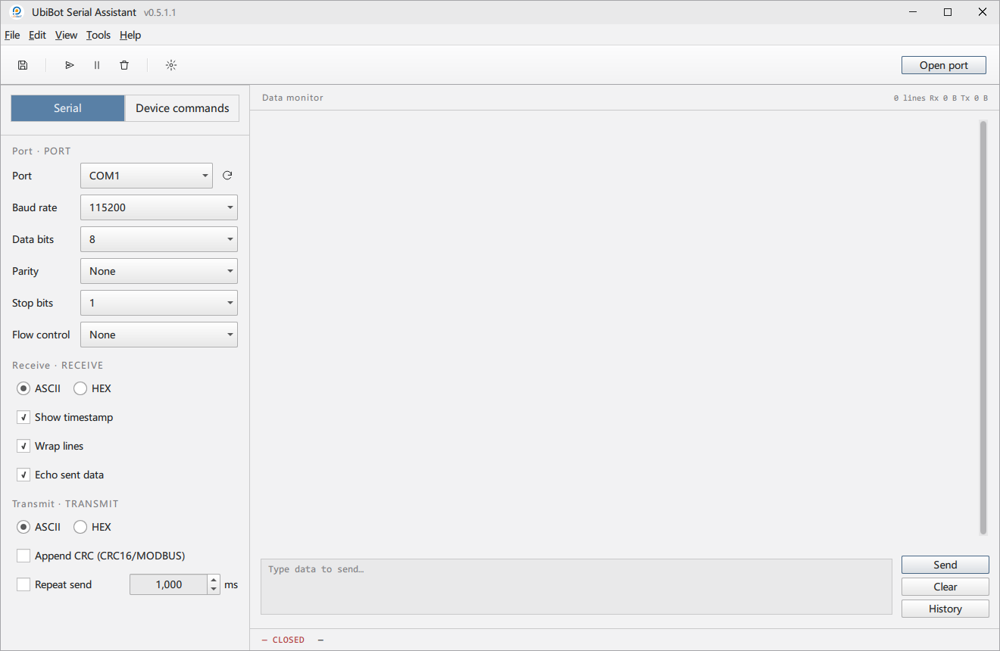
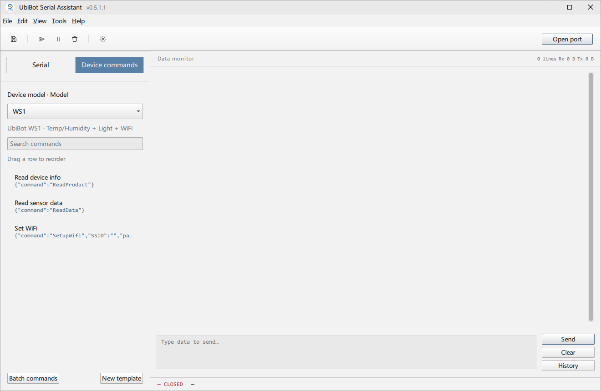
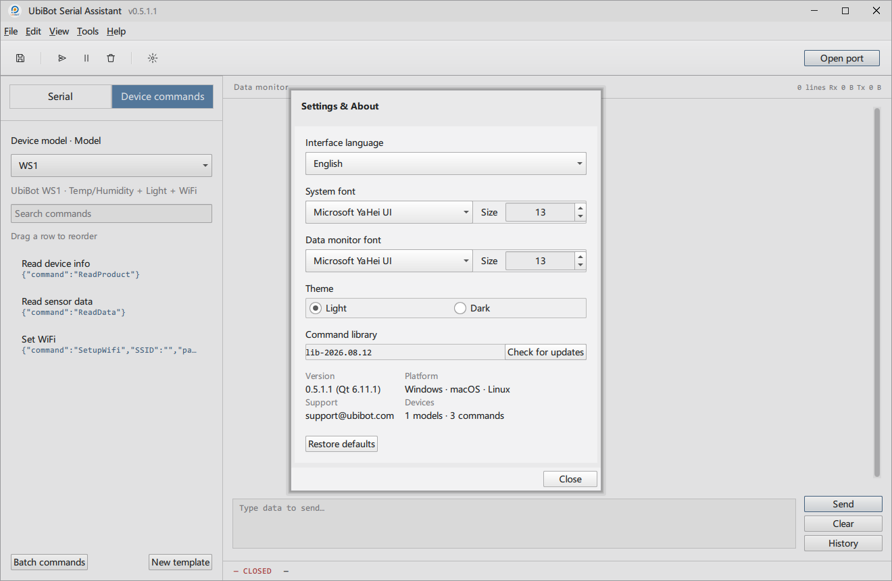

# UbiBot Serial Assistant

A serial-port debugging tool for UbiBot IoT devices (WS1, WS1 Pro, GS1-AL4G1RS,
SP1, …), built with Qt 6.11 / QML / C++17. A native, lightweight desktop app
— not a bundled browser runtime — that speaks both plain-text AT commands
and JSON-payload device protocols, with a server-maintained, remotely
updatable command library so new devices don't require a new app build to
reach people who already have it installed.

## Download

Pre-built, self-contained packages — no Qt install, nothing else needed —
are published on the [Releases page](https://github.com/ubibot-open/ubibot-serial-sync/releases).
These links always resolve to the newest build:

| Platform | Download |
|---|---|
| Windows | [UbiBotSerialAssistant-windows-x64.zip](https://github.com/ubibot-open/ubibot-serial-sync/releases/latest/download/UbiBotSerialAssistant-windows-x64.zip) |
| macOS | [UbiBotSerialAssistant-macos.dmg](https://github.com/ubibot-open/ubibot-serial-sync/releases/latest/download/UbiBotSerialAssistant-macos.dmg) |
| Linux | [UbiBotSerialAssistant-linux-x86_64.AppImage](https://github.com/ubibot-open/ubibot-serial-sync/releases/latest/download/UbiBotSerialAssistant-linux-x86_64.AppImage) (`chmod +x`, then run — no install needed) |

Neither the Windows .exe nor the macOS .app/.dmg is code-signed, so first
run triggers a stock "unknown publisher" warning from SmartScreen/Gatekeeper
— click through it (or right-click → Open on macOS) same as any other
unsigned open-source binary.

**Building from source is not required to use this app** — see
[BUILD.md](BUILD.md) only if you want to build it yourself, extend it, or
understand how it's put together internally.

## User interface

The window is a single frameless, custom-drawn title bar and window frame
(not the OS-native one), so the whole window — not just its contents —
follows the app's light/dark theme.

**Serial connection settings** — port, baud rate, data/stop bits, parity,
flow control, plus receive options (timestamps, line wrap, echo) and
transmit options (ASCII/HEX mode, CRC16/MODBUS append, repeat-send
interval):

**Device command library** — searchable, per-model AT/JSON command sets
with drag-to-reorder, your own quick-send templates, and saved multi-step
"batch commands":

**Settings & About** — runtime language switch, font pickers, light/dark
theme, and the device command library's own version/update status:

Beyond what's pictured above: a real menu bar (`File`/`Edit`/`View`/`Tools`/
`Help`) and toolbar (save log, send, pause, clear, settings, open/close
port) above these panels, and — always visible regardless of which panel is
active — a right-hand data monitor pane with a color-coded TX/RX/SYS/ERR log
and a manual-send box with history.

## Features

### Serial I/O (`QSerialPort`)
- Full port configuration: baud rate, data bits, parity, stop bits, flow
  control.
- ASCII or HEX transmit/receive.
- Optional CRC16/MODBUS checksum, appended automatically to every outgoing
  send (manual or device-library) when enabled.
- Repeat-send: resend the current manual-send box contents on a fixed
  interval.
- Echo sent data into the log, with per-line timestamps and line-wrap
  toggles.
- Manual-send history — every sent line is kept, double-click to reuse.

### Device command library
- Per-model command sets, grouped and searchable, for both plain-text AT
  commands (`AT+INTERVAL=<sec>`) and JSON-payload devices (base64-encoded
  command bodies).
- A parameter panel pops up for any command that takes arguments; picking a
  model that ships recommended serial settings offers to apply them.
- Drag-to-reorder the command list; "My templates" for your own quick-send
  snippets (add/edit/delete, unrelated to any specific device); "Batch
  commands" for a saved, named sequence of steps sent one at a time on a
  fixed interval (each step independently ASCII/HEX and CRC-toggle-able).
- Add a model or command by editing a JSON file — no recompile needed for
  content changes.

### Device command library remote updates
- The device/command data above doesn't have to be baked into the binary:
  the app can check a configured backend for a newer version and download
  it in place (no restart required).

### Software self-update (currently disabled)
- A full "check for a new app version → download → verify → swap →
  relaunch" flow exists (Windows-only) and works end to end, but its menu
  entry is currently commented out because the backend registration it
  depends on hasn't been deployed yet.

### Data monitor
- Color-coded TX/RX/SYS/ERR log, byte counters, pause/clear.
- One-shot export to plain text / CSV / HEX dump.
- Optional continuous, daily-rotating file logging.

### Remote support (early preview)
- Session-code/OTP generation and permission toggles are fully built, but
  there's no signaling/relay server or peer-to-peer transport behind them
  yet, and the panel isn't currently reachable from the main window at all
  (see [BUILD.md](BUILD.md#design-notes)).

### Internationalization
English, Simplified & Traditional Chinese, Japanese, Korean, Russian,
French, and Italian today, switchable at runtime from Settings & About,
each language shown by its own native name.

### Light/dark theme
Switchable at runtime, applied to the whole window including its custom
title bar.

### Cross-platform
One Qt/QML/C++17 codebase builds standalone packages for Windows, macOS,
and Linux, all produced automatically on every tagged release — see
[BUILD.md](BUILD.md#publishing-a-release-build-via-github-actions).

## Advantages

- **Native and lightweight** — Qt Quick/QML, not a bundled browser runtime;
  a real desktop app with a small footprint and fast startup, not an
  Electron wrapper.
- **Data-driven device support** — adding a new UbiBot model or command is
  a JSON edit, not a code change or a recompile, and (via the remote-update
  mechanism) doesn't even require shipping a new app build to reach users
  who already have it installed.
- **One codebase, three platforms** — Windows/macOS/Linux builds come from
  the same source tree and the same CI pipeline, not three separately
  maintained ports.
- **Fully localized**, not just translated strings bolted on after the
  fact — every UI surface (including the frameless title bar) respects the
  active language and theme.
- **Free for commercial use** — LGPLv3, dynamically linked against Qt (see
  [BUILD.md's Qt 6 module licensing](BUILD.md#qt-6-module-licensing-commercial-use-check)
  section) — no Qt commercial license needed to use, modify, resell, or
  embed this software.
- **Reproducible, automated releases** — every tagged version is built and
  published by CI from a clean checkout, not hand-assembled on someone's
  laptop.

## License

This project is licensed under the **GNU Lesser General Public License v3.0
(LGPLv3)** — see [LICENSE](LICENSE). Because LGPLv3 incorporates GPLv3 by
reference, the GPLv3 text it points to is also included verbatim in
[COPYING](COPYING) (with [COPYING.LESSER](COPYING.LESSER) holding the same
LGPLv3 terms as `LICENSE`, per the FSF's own convention for projects that
use this license pair). See [BUILD.md](BUILD.md#qt-6-module-licensing-commercial-use-check)
for the Qt module licensing/commercial-use compatibility check.
